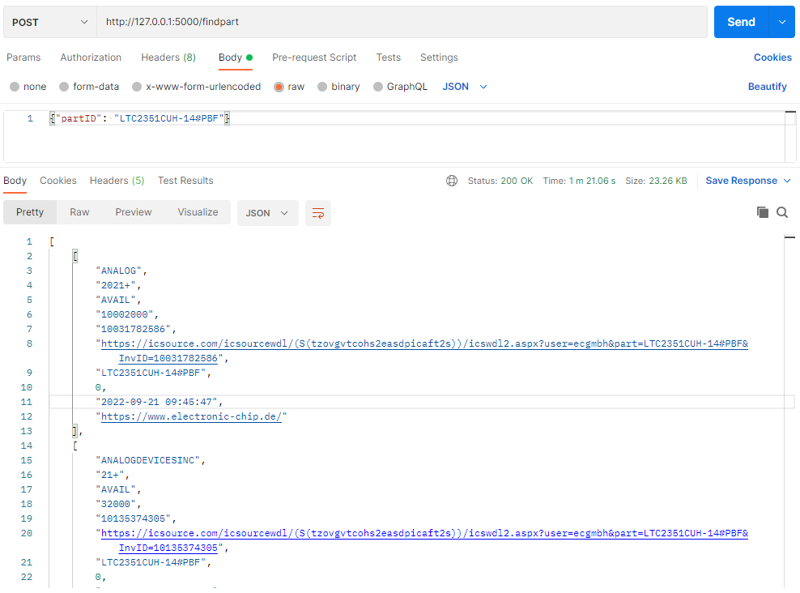
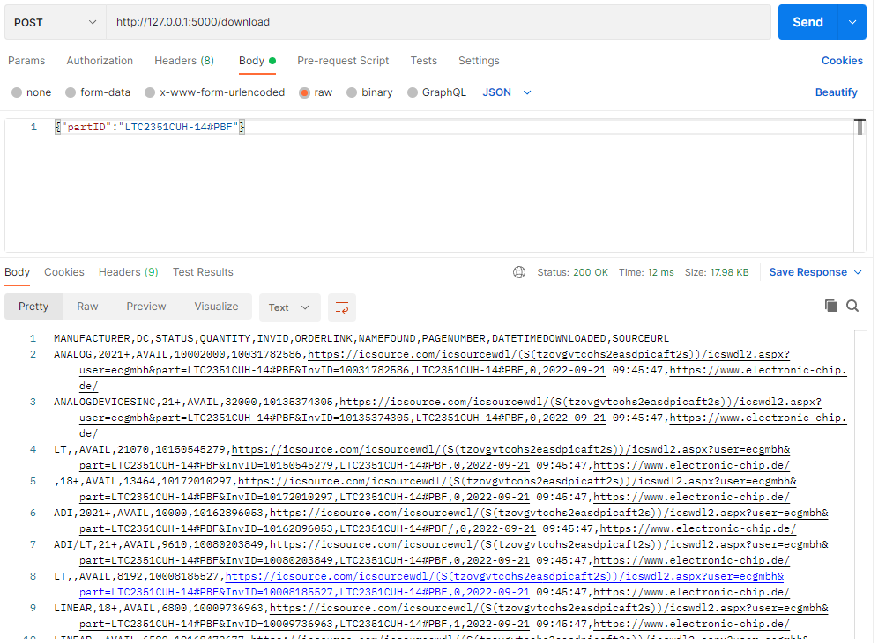
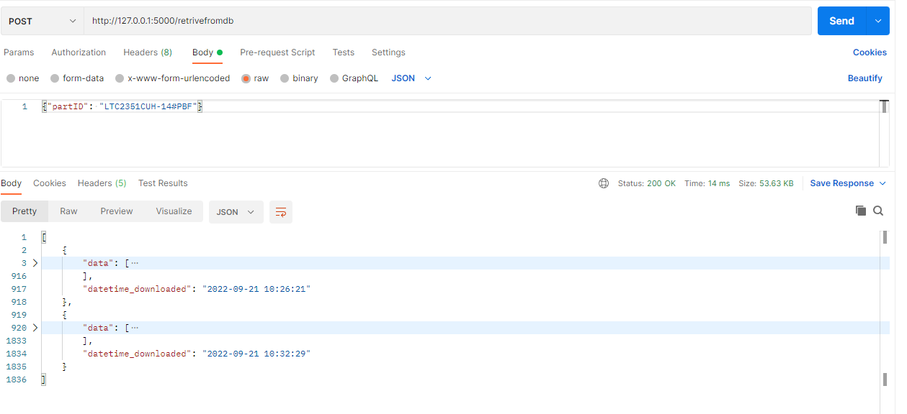

# Alpas scraper.

# To Run
    docker compose up --build 

# To scrape the distributors for the component.

    POST request (with POSTMAN see screenshot folder)
    url http://127.0.0.1:5000/findpart
    body {"partID": "LTC2351CUH-14#PBF"}

# To download the csv for the most recent component. (it overwrites previous csvs)

    POST request (with POSTMAN see screenshot folder)
    url http://127.0.0.1:5000/download
    body {"partID": "LTC2351CUH-14#PBF"}

# To retrive data from the database for a component id 

    POST request (with POSTMAN see screenshot folder)
    url http://127.0.0.1:5000/retrivefromdb
    body {"partID": "LTC2351CUH-14#PBF"}

    Returns multiple results if that component id has been scraped more than once.

## Files are automatically saved in the docker volume created on your computer.

# If i had more time.

I would spin up a redis instance and using the rq package of python i would submit jobs for a worker to do in the background. This is because the request stays in loading mode. 

